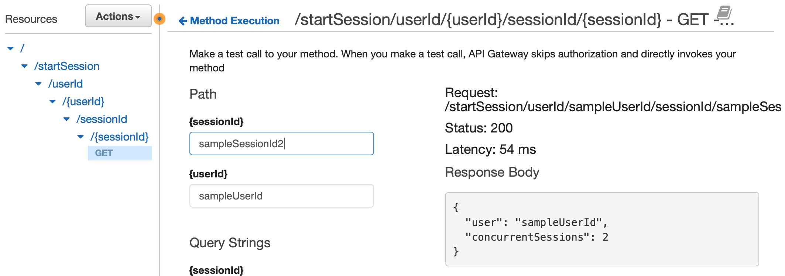
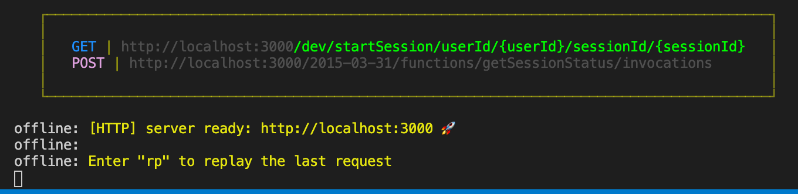

# The Concurrency Service
A Node.js service to catch out the account-sharers!

A client calls the API, and the service checks how many video streams a given user is watching. If it's more 3 concurrent streams, the API will return an error code.

## How it works:

* The concurrency service works on the assumption that the client can provide:
    * A unique `userId` for the user who is attempting to start a stream
    * A unique `sessionId` that corresponds to the specific streaming session that the user is starting.
* Both of the above are required parameters when calling the API.
* Upon each session initiation, the service keeps track of how many active sessions are associated with a user, by storing an item in a database per session. If a client provides details of a session that is already active (it's already in the DB), it will skip storing this.
* Technologies used are:
    * AWS API Gateway
    * AWS Lambda
    * AWS DynamoDB
    * Serverless Framework

## How to deploy the service:

* If you have an AWS account and can [authenticate via the AWS cli](https://docs.aws.amazon.com/polly/latest/dg/setup-aws-cli.html), this service can be deployed using the serverless framework via the following command:

``` sls deploy ```

* You can then test the API via the AWS console:



## How to run the service locally:

* To run the service locally, I've included the `serverless-offline` and `serverless-dynamodb-local` plugins (more information can be found here). 
* Running the command below will automatically trigger `serverless dynamodb start` for the local database, in addition to starting up a local server to access the API:

```sls offline start```

* You should see something like this in the console:



* From this point, you should be able to make requests to the API using Postman or, for example, using `curl`:

``` 
curl --location --request GET 'http://localhost:3000/dev/startSession/userId/thisIsaTestUserId/sessionId/thisIsaTestSessionId' --header 'Content-Type: application/json' --header 'x-api-key:{{KEY_THAT_IS_REFERENCED_IN_THE_TERMINAL}}' 
```

## Expected responses

* Whether you deploy to AWS and trigger the API via the web console, or run it locally via the terminal, a successful response `body` looks like this, with a `statusCode` of `200`:

```
{
  "user": "abc",
  "concurrentSessions": 1
}
```

* Once you hit `>3` requests for the same `userId`, you should expect a `400` status, with a message like this:

```User abc is trying to watch 4 streams at once, which is too many.```

* If a client leaves either the `userId` or `sessionId` blank, then you should expect a `400` with the following message:

```Please specify a userId and sessionId```

## Running unit tests:
* Unit tests are written using `jest`, and can be run with the following command:

``` npm test ```

## Next steps:
* How do you determine whether a user's session has finished or expired? At the moment, items in the database persist forever unless you manually delete them - which is of course a problem!
    * My next step would be to create a second path on the API that a client can call when a user takes an action to exit a stream, which would delete the corresponding session item from the database. 
    * The above covers a 'happy path', but what about sudden unexpected stream exits where the client can't be expected to fulfil a deletion request (e.g a power outage), or long periods of user inactivity? I've considered adding a TTL on the dynamoDB items, although the [precision/AWS SLA](https://aws.amazon.com/premiumsupport/knowledge-center/ttl-dynamodb/) is probably not fit for purpose here. A TTL would also require a slight change to the logic in `processRequest` in terms of 'skipping' the DB item insertion.
    
## Improvements to be made:
* Reduction of repeated code in `processRequest`
* Improved logger function (e.g. with different log levels), rather than just `console.log`
* Wider test coverage, as described in commented-out code in `index.test.ts` (e.g. covering the scenario where an active `sessionId` is provided and we don't want to update the count of concurrent sessions)

## Other approaches to the solution:
* A messaging pattern to handle many senders at once, where the lambda processes the messages in batches? (e.g SQS/Kinesis)
